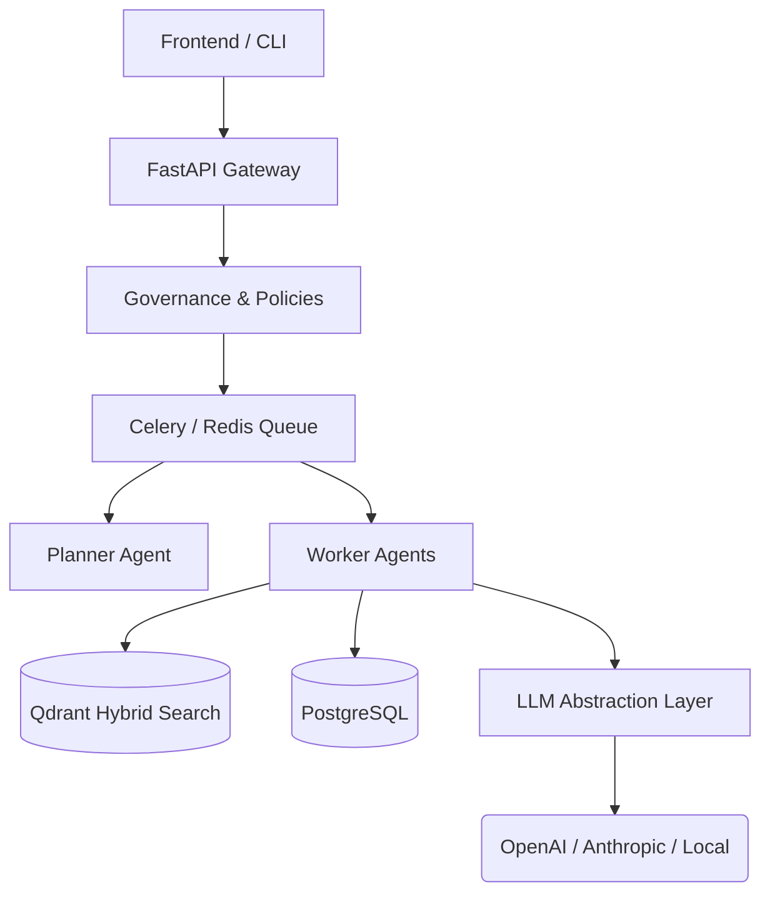

# Veridex: Enterprise-Grade AI Agent Orchestration

Veridex is a distributed, multi-tenant AI platform designed for enterprise reliability. Unlike basic "wrapper" apps, Veridex provides a complete infrastructure layer—from model-agnostic routing and context-aware orchestration, to chaos-engineered worker pools and strict data governance.

## 🌟 Key Features

- **Multi-Agent Orchestrator**: Planners decompose complex tasks; Workers execute them asynchronously via Celery/Redis.
- **Enterprise Governance**: Hard multi-tenancy, declarative OPA-style YAML policies, and immutable audit ledgers.
- **Observability & Evaluation**: Full LLM-as-a-Judge evaluation framework, complete DAG trace recording, and versioned prompts.
- **Cloud-Native**: Horizontally scalable, Helm-deployed, with Istio service mesh retries handling LLM provider volatility.
- **Extensible SDK**: Dynamically load new Connectors and Tools via the Python `veridex` SDK.

## 🏗 Architecture Overview



## 🚀 Quick Start
```bash
# 1. Start infrastructure (Postgres, Redis, Qdrant)
docker-compose up -d

# 2. Install dependencies & Run Backend
cd backend && uv sync
uv run uvicorn app.main:app --reload

# 3. Use the SDK/CLI
veridex login --token YOUR_TOKEN
veridex agent-run --goal "Analyze Q3 retention metrics"
```

For full setup, deployment, and contribution guidelines, see our `/docs` folder.